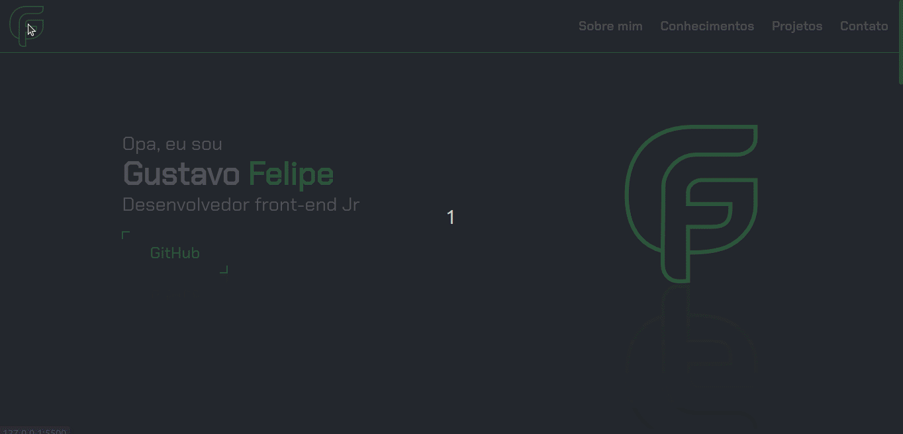
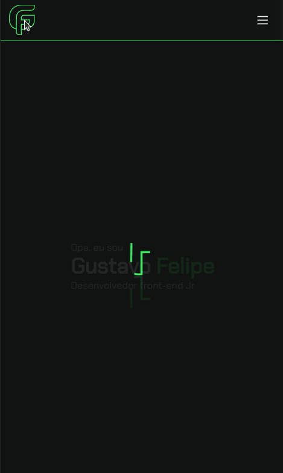

# Portfólio

<p><b> :computer: Desktop:</b></p>

<hr>

<p><b> :iphone: Mobile:</b></p>
<br/>

<hr>

Projeto desenvolvido para mostrar um pouco mais do meu trabalho.

### Desáfios:

Atualmente o projeto está concluído, entretanto não está terminado. O processo de criação não prende o projeto a algo fixo para sempre, tudo é mutável e conforme eu vá evoluindo o site também irá. Dando continuidade ao projeto depois de um ano, resolvi testar como estão minhas enferrujadas habilidades tentando retirar uma terceira versão deste projeto.
As atividades desempenhadas seguem mapeadas abaixo:

- [x] Idealização;
- [x] Prototipação das telas;
- [x] Construção do projeto Beta (HTML e CSS);
- [x] Refatoração 1 - (Melhorar código HTML e CSS);
- [x] Implementar responsividade;
- [x] Criar navbar responsiva para acesso ao site via mobile;
- [x] Implementar scroll suave;
- [x] Refatoração 2 - (Melhorar a navbar, responsividade nas mudanças de tamanho da tela, adição de efeitos e animações);
- [x] Implementar formulário para contato;
- [x] Implementar a V2.0 do site portfólio;
- [x] Refatoração 3 - Nova versão do site com elementos mais atuais;
- [x] Prototipação das telas via Figma;
- [x] Implementar uma nova Navbar que funcione corretamente com responsividade ao mobile (comecei refazendo o menu);
- [x] Criação das estruturas HTML das páginas;
- [x] Estilização via CSS;
- [x] Busca e implementação de animação ao invés de usar GIFs (santa gambiarra);
- [x] Criação da logo;
- [x] Refatorar as imagens .png e .jeg por .svg (otimização);
- [x] Remover estrutura de código das versões anteriores junto aos arquivos;
- [x] Atualizar o Readme;
- [x] Refatoração 4 - Nova logo, elementos e estilos;
- [x] Atualizar telas via Figma;
- [x] Menu mobile refatorado;
- [x] Novos ícones adicionados;

### Instalação:

Para iniciar, efetue o clone do projeto do GitHub em um diretório de sua preferência:

```shell
cd "diretorio de sua preferencia"
git clone https://github.com/gustavofbc/gustavofbc.github.io.git
```

Em seguida, para verificar o projeto funcionando, abra-o usando o live-server em seu vscode ou abra o arquivo "index.html" utilizando o navegador de sua preferência.

e voalá! :tada:

<i> \_que a força esteja com você meu caro mestre/padawan/sith. </i>
